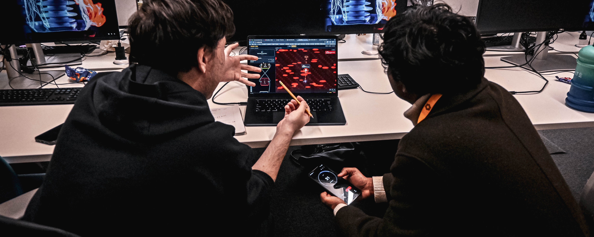

  

👋 Hey, I'm **Kazybek (Kazy)**

I build things. Mostly robots, sometimes drones, often with a bit of AI mixed in.

CS student in the UK. In my own time I mess around with **C++**, **ROS/ROS2**, **NVIDIA Isaac Sim**, and microcontrollers (such as **Raspberry Pi** and **ESP-32**).

I show up to hackathons a lot, build side projects when I should be revising, and read too much about startups for someone who isn't running one.

---

### 🌐 Socials

